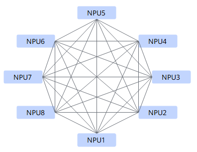

# Mesh

## 算法描述

Mesh是FullMesh互联拓扑内的基础算法，是NPU之间的全连接，任意两个NPU之间可以直接进行数据收发。

Mesh算法实现AllReduce算子的流程如下图所示，每个NPU并发的使用多路HCCS链路从对端读取或者写入数据，使双工互联链路的双向带宽同时得到利用。

Mesh算法的时间复杂度是O\(1\)。

## 耗时计算

**表 1**  Mesh算法中各操作计算耗时

| 操作          | 耗时                             |
| ------------- | -------------------------------- |
| Scatter       | $\alpha+\frac{1}{p}n\beta$       |
| Gather        | $\alpha+\frac{1}{p}n\beta$       |
| Broadcast     |  实现为Scatter + AllGather，耗时为：  $ 2\alpha + \frac{2}{p}n\beta $     |
| Reduce       |  实现为ReduceScatter + Gather，耗时为：  $ 2\alpha + \frac{2}{p}n\beta + \frac{p-1}{p}n\gamma  $     |
| ReduceScatter | $ \alpha+\frac{1}{p}n\beta+\frac{p-1}{p}n\gamma $|
| AllGather        | $\alpha+\frac{1}{p}n\beta$       |
| AllReduce     | 实现为ReduceScatter + AllGather，耗时为：  $2\alpha+\frac{2}{p}n\beta + \frac{p-1}{p}n\gamma  $                                   |