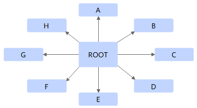

# Star

## 算法描述

Star算法适用于有根节点的通信操作（如Broadcast、Reduce、Gather、Scatter等），利用星型拓扑或全连接拓扑一步完成通信操作。以Broadcast算子为例，Star算法实现如下图所示，根节点Root利用星型拓扑从其他各节点收集数据。

## 耗时计算

定义每个非根节点与根节点的通信数据大小为n，那么完成整个Star算法的通信耗时为：$ \alpha +\beta n$。

