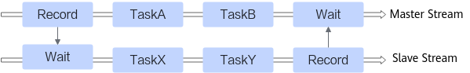
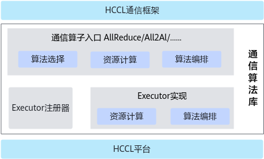
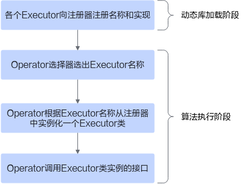
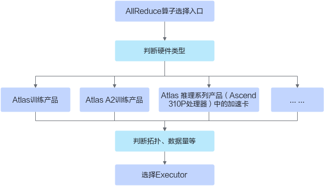
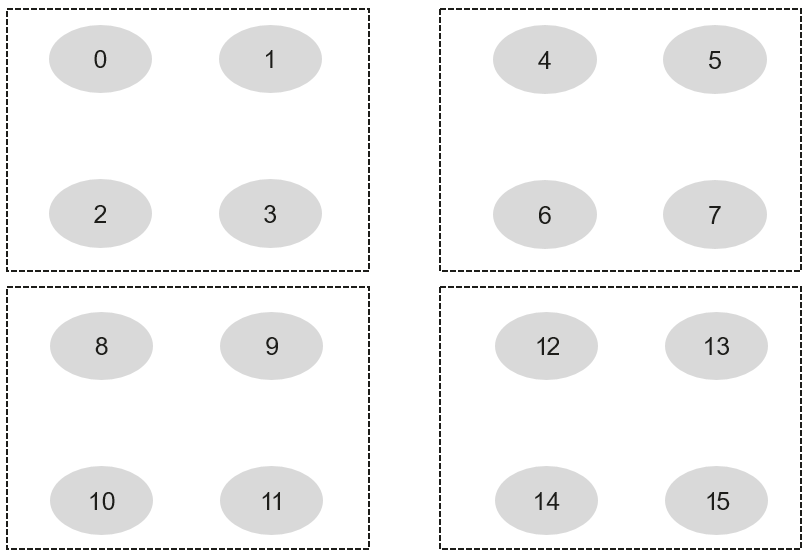
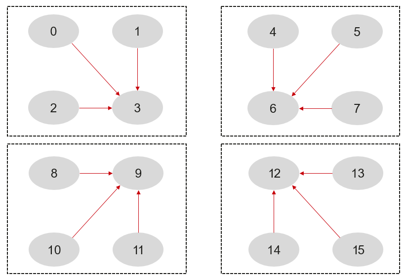
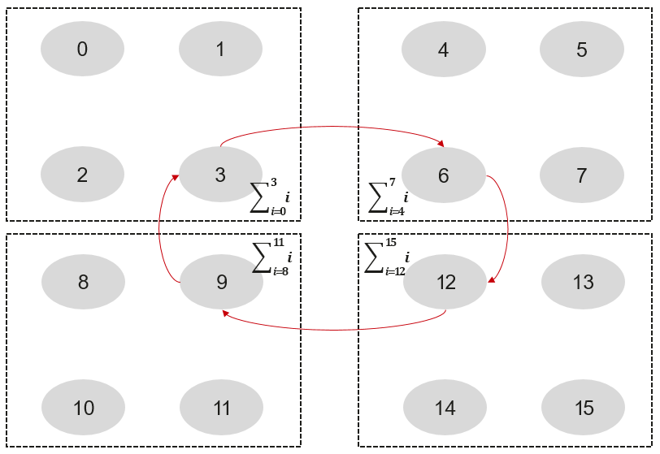
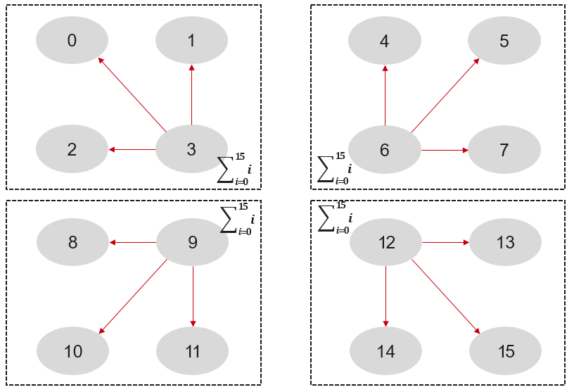
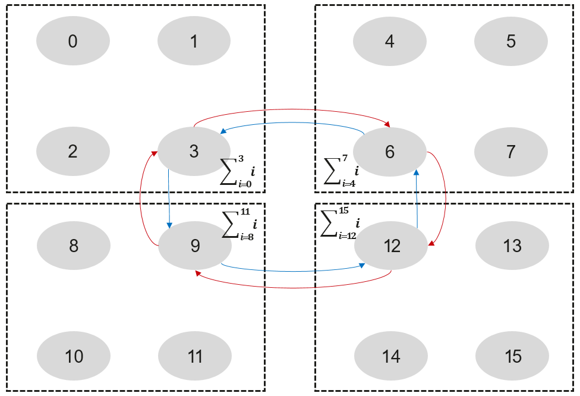

# 背景知识<a name="ZH-CN_TOPIC_0000001906937880"></a>

为了您有更好的阅读体验，了解集合通信算法定制开发流程前，请先了解以下概念。

## 存储<a name="section1090371054811"></a>

存储是集合通信执行所需要的各种Buffer资源，集合通信执行中涉及到以下几种Buffer：

-   Input Buffer：集合通信算子输入数据缓冲区。
-   Output Buffer：集合通信算子输出数据缓冲区。
-   CCL Buffer：一组地址固定的Buffer，单算子模式下，通信实体通过CCL Buffer来实现Rank间的数据交换。

    CCL Buffer和通信域绑定，通信域初始化的时候创建两块CCL Buffer，分别称为CCL\_In和CCL\_Out。CCL\_In和CCL\_Out默认大小是200M Byte，可以通过环境变量HCCL\_BUFFSIZE进行修改。同一个通信域内执行的集合通信算子都复用相同的CCL Buffer。

    

-   Scratch Buffer：有些算法计算过程中需要额外的存储空间，这部分额外的存储空间，称为Scratch Buffer。

## 流/主从流<a name="section1966725241513"></a>

流（Stream）是NPU上的一种硬件资源，承载了待执行的Task序列。Task可以是一个DMA操作、一个同步操作或者一个NPU算子等。同一个流上的Task序列按顺序执行，不同流上的Task序列可并发执行。

由AI框架（例如PyTorch等）调用集合通信API时传入的Stream对象称为主流，为实现集合通信的并行性而额外申请的Stream对象称为从流。主从流之间通过Post/Wait这一组Task进行同步。主从流之间没有依赖关系时，Task可并行执行，如下图中主流的TaskA、TaskB和从流的TaskX、TaskY可并行执行。



例如，AllReduce算子的执行入口HcclAllReduce接口定义如下所示：

```
// 参数传入的stream是主流
HcclResult HcclAllReduce(void *sendBuf, void *recvBuf, uint64_t count, HcclDataType dataType,
                           HcclReduceOp op, HcclComm comm, aclrtStream stream)
```

## Notify<a name="section980101047"></a>

Notify是NPU上的硬件资源，用来做同步。在集合通信中主要有两种作用：

-   进行主从流之间的同步。
-   进行Rank间数据收发的同步。

和Notify有关的Task有两种：Post和Wait（即[流/主从流](#section1966725241513)中的Post/Wait这组Task），其中Post是非阻塞操作，作用是给对应的Notify寄存器置1，如果对应的Notify值已经是1，则不产生变化；Wait是阻塞操作，会等待对应的Notify值变为1。当预先设置的条件满足后，会将对应的Notify值复位为0，并继续执行后续的Task。

下图是一个主从流同步的示例，主流通知从流，实质是将Notify1置位为1；从流通知主流，实质是将Notify2置位为1。



同样，Rank间的数据收发也需要同步，比如向远端Rank写数据前，得知道远端是否准备好接受数据的Buffer。关于Rank间的同步，可参见[Transport链路](#section4214422122213)。

## Transport链路<a name="section4214422122213"></a>

要完成Rank间的数据通信需要先建立transport链路，transport链路分两种：SDMA链路（对应到HCCS/PCIE硬件连接）和RDMA链路（对应到RoCE硬件连接）。

-   SDMA transport链路的两端各有2种类型的Notify，分别称为**Ack、DataSignal。**
-   RDMA transport链路的两端各有3种类型的notify，分别称为**Ack、DataSiganl、DataAck。**

每条transport链路会申请各自的Notify资源，不同的transport之间不会复用Notify。所以SDMA链路会申请4个Notify，每端各2个；RDMA链路会申请6个Notfy，每端各有3个。

下面分别介绍SDMA链路与RDMA链路的数据收发同步流程：

-   SDMA数据收发同步

    一次SDMA数据收发需要两组同步，如下图所示，分别使用了Ack和DataSignal两个Notify。为了避免同一条链路上多次收发数据相互影响，同步需以Ack开始，以DataSignal结束。

    

-   RDMA数据收发同步

    一次RDMA数据收发需要三组同步信号，如下图所示。这是因为RDMA操作在流上是异步执行的，所以Rank 0执行完Write和Post DataSignal之后，并不知道数据什么时候写完，因此需要Rank1 Wait DataSignal满足条件后，再给Rank 0发送一个DataAck同步信号，通知Rank0数据已经写完了。

    为了避免同一条链路上多次收发数据相互影响，RDMA数据同步需以Ack开始，以DataAck结束。

    

## 通信域/子通信域/算法分层<a name="section45991022161616"></a>



有一个4\*4的通信域，如上图所示，其中一个方框表示一个server，一个server内有4个rank，rank编号从0到15，这边的0-15的rank编号我们称之为userRank。userRank是指rank在通信域中的编号。

接下来我们在这个4\*4的通信域上演示一个2层的AllReduce算法，Reduce类型为SUM。这边按照server内和server间进行分层，server内有一个子通信域，server间有一个子通信域。

1.  首先在server内执行Reduce操作。

    

2.  server间执行ring算法的AllReduce。

    

3.  server内执行BroadCast。

    

三步执行完成之后，4\*4的AllReduce执行完成，每个rank上都获取了0\~15共16个rank的所有数据。

其中第二步执行server间算法时使用了一个ring环。这边可以进一步优化，将链路的另一个方向也利用起来，组成两个ring环，待传输的数据一分为二在两个ring环上分别进行传输，此时server间这一层存在两个子通信域。在子通信域内，每个rank有一个子通信域内的编号，称为subCommRank，比如这边的3、6、9、12四个userRank对应的subCommRank分别是0、1、2、3。



